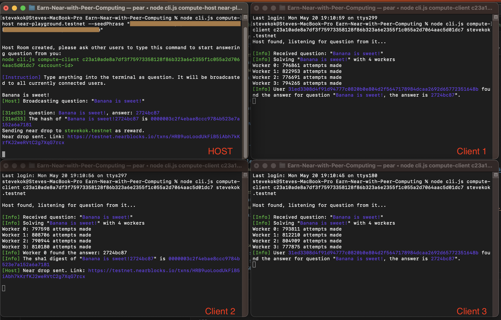

# Description

This repo is a sample repo to demonstrate the idea of how we can share computing resources over the p2p network, and get paid by blockchain.

---

# Purpose of p2p and blockchain

The advantages of using p2p and blockchain is that both the host and user will be anonymous, no IP address, or identity can be trace.

---

# Preparation before running

## Step 1: Install Pear

This project needs `Pear` to be installed globally. `Pear` is a library to support peer to peer connections.

Follow [this guide](https://docs.pears.com/guides/getting-started) to install `Pear`.

Verify that you have installed `Pear` successfully by running this terminal command:

```shell
pear run pear://keet
```

## Step 2: Register some testnet account

Go to [mynearwallet testnet website](https://testnet.mynearwallet.com/) and register some testnet accounts.

Remember to copy down the `seed phrase` while registering, it will be used in the examples.

## Step 3: Clone this project and run npm install

Clone the project, then while inside the root of the project, run:

```shell
npm install
```

Verify that you have successfully install the project by running:

```shell
node cli.js
```

---

# How to run this example

## Step 1: Start a compute task host

Inside the root of project, run this terminal command:

```shell
node cli.js compute-host <account-id> --seedPhrase "<seed-phrase>"
```

If things is working fine, you will see this in the terminal

```shell
Host Room created, please ask other users to type this command to start answering question from you:
node cli.js compute-client xxxxx <account-id>
```

## Step 2: Create clients

Copy the command shown from step 1, then try to open multiple other terminals and run multiple copies of clients.

You can run as many clients as you want, including on another computer.

If the client as run successfully, you will see this inside the terminal:

```shell
Host found, listening for question from it...
```

Due to the way how p2p was connected, depends on network condition, sometimes the host can't be found.

## Step 3: Test it!

Go back to the host terminal created in step 1, try to type any text into it, such as `Hello World!`, then see it in action.

## Screenshot


